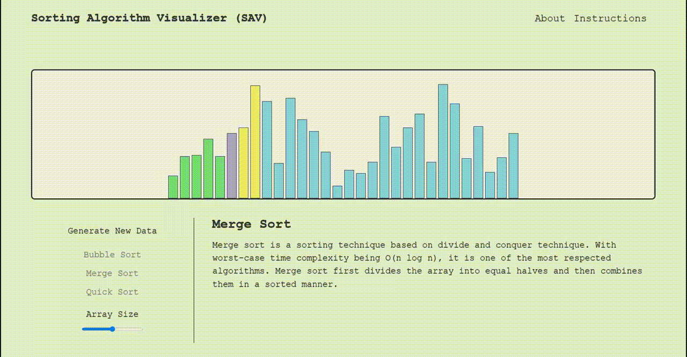
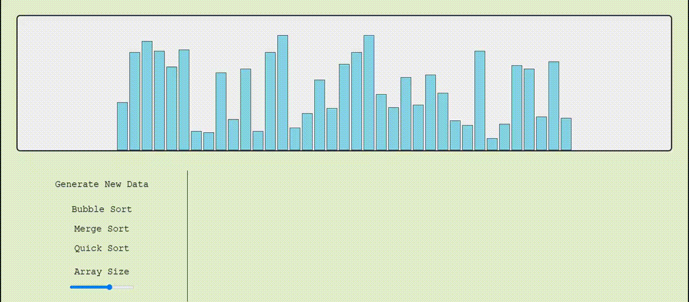

# SAV - Sorting Algorithm Visualizer

SAV is an interactive web app dedicated to helping users visualize popular sorting algorithms (currently bubble sort, merge sort, quick sort). This web app serves to provide users a brief overview of the difference in approach and performance across different sorting algorithms.

<br>
<div align="center">
  
</div>

## Technologies Used

SAV was implemented using purely vanilla Javascript, HTML5, and CSS3.
## Key Features

### Random Data Generation

Interactive graph that can render completely random data whenever the user chooses to do so. The amount of data can also be adjusted using a slider to either scale up or down the amount of bars rendered.

<br>
<div align="center">
  <p>GIF example of interactive graph</p>
  
</div>
<br>
<div align="center">
  <p>Code snippet of interactive graph</p>
</div>

```js
  generateArray (amount) {
    this.deleteArray();
    const newArray = [];

    for (let i = 0; i < amount; i++) {
      newArray.push(this.getRandomInt(5, 100))
    };

    return newArray;
  };

  render (array) {
    const graph = document.querySelector(".graph");

    for (let i = 0; i < array.length; i++) {
      const bar = document.createElement("div");

      bar.classList.add("bar");
      bar.style.height = `${array[i] * Math.PI}px`;

      graph.appendChild(bar);
    };
  };
```
### Bubble Sort / Merge Sort / Quick Sort Visualization

Integrated visualization of three common sorting algorithms, achieved by refactoring the base algorithms to account for manipulation of the DOM.

<div align="center">
  <br>
  <p>Code snippet of bubble sort algorithm</p>
</div>

```js
export default async function bubble (sortFunc, bars) {
  for (let i = 0; i < bars.length - 1; i++) {                // iterating through the length of the NodeList
    for (let j = 0; j < (bars.length - i - 1); j++) {        // iterating through the length of the NodeList MINUS the sorted bars
      bars[j].style.background = "#FF6D6A";                  // setting the two bars being compared to a different color
      bars[j + 1].style.background = "#FF6D6A";

      let bar1 = parseInt(bars[j].style.height);
      let bar2 = parseInt(bars[j + 1].style.height);

      if(bar1 > bar2) {
        await sortFunc.delay(250);                           // hard coding a value of 250ms for the delay between comparisons
        swap(bars[j], bars[j + 1]);
      };

      bars[j].style.background = "#8BD3E6";                  // regardless of swap, setting compared bars back to original color
      bars[j + 1].style.background = "#8BD3E6";
    };

    bars[bars.length - i - 1].style.background = "#E9EC6B";  // coloring bars bubbled up to the end to denote that it is sorted
  };

  bars[0].style.background = "#E9EC6B";                      // ensuring remaining bar after sorting is colored
};
```

<div align="center">
  <br>
  <p>Code snippet of merge sort algorithm</p>
</div>

```js
async function mergeHelper (sortFunc, bars, min, max, middle) {
  const leftHalf = middle - min + 1;                      // defining the left half of the array
  const rightHalf = max - middle;                         // defining the right half of the array

  let left = new Array(leftHalf);                         // creating new array to contain the split up left half
  let right = new Array(rightHalf);                       // creating new array to contain the split up right half

  for (let i = 0; i < leftHalf; i++) {                    // iterating through left half and giving it a color
    await sortFunc.delay(200);                            // hard coding a value of 200ms for the delay between comparisons

    bars[min + i].style.background = "#B1A2CA";
    left[i] = bars[min + i].style.height;                 // storing each height of the bars into left half
  };

  for (let i = 0; i < rightHalf; i++) {                   // iterating through right half and giving it a DIFFERENT color
    await sortFunc.delay(200);

    bars[middle + 1 + i].style.background = '#E9EC6B';
    right[i] = bars[middle + 1 + i].style.height;         // storing each height of the bars into right half
  };

  await sortFunc.delay(200);

  let i = 0, j = 0, k = min;

  while (i < leftHalf && j < rightHalf) {                // iterating through both arrays (as long as neither are empty) to "merge" the bars together
    await sortFunc.delay(200);

    if (parseInt(left[i]) <= parseInt(right[j])) {       // comparing heights between each bar in the respective arrays
      bars[k].style.height = left[i];                    // left side merge
      bars[k].style.background = '#77DD77';
      i++;
      k++;
    } else {
      bars[k].style.height = right[j];                   // right side merge
      bars[k].style.background = '#77DD77';
      j++;
      k++;
    };
  };

  while (i < leftHalf) {                                // in case either array runs out, iterate through a singluar half to "merge" the bars to the main array
    await sortFunc.delay(200);
    bars[k].style.background = '#77DD77';
    bars[k].style.height = left[i];                     // left side merge
    i++;
    k++;
  };

  while (j < rightHalf) {                                // in case either array runs out, iterate through a singluar half to "merge" the bars to the main array
    await sortFunc.delay(200);
    bars[k].style.background = '#77DD77';
    bars[k].style.height = right[j];                     // right side merge
    j++;
    k++;
  };
};
```


<div align="center">
  <br>
  <p>Code snippet of quick sort algorithm (utilizing Lomuto partition, specifically)</p>
</div>

```js
async function partition (sortFunc, bars, left, right) {  // this particular implementation of partition is the Lomuto partition, using the last element as the pivot
  bars[right].style.background = "#E9EC6B";               // pivot bar

  let i = left - 1;                                       // index of smallest bar

  for (let j = left; j <= right - 1; j++) {
    bars[j].style.background = "#EFBE7D";                 // currently selected bar to compare to pivot

    await sortFunc.delay(250);                            // hard coding a value of 250ms for the delay between comparisons

    if (parseInt(bars[j].style.height) <= parseInt(bars[right].style.height)) {   // checking for elements less or equal to the pivot
      i++;                                                // increment to the next bar
      swap(bars[i], bars[j]);

      bars[i].style.background = "#FF6D6A";               // color of the bars LESS than the pivot bar after swap

      if (i !== j) bars[j].style.background = "#B1A2CA";  // color of the bars MORE than the pivot bar after swap
      await sortFunc.delay(250);
    } else {
      bars[j].style.background = "#B1A2CA";               // color of the bars MORE than the pivot with no swap
    }
  }

  i++;
  await sortFunc.delay(250);

  swap(bars[i], bars[right]);

  bars[right].style.background = "#B1A2CA";              // ensuring bars MORE than the pivot are the same color
  bars[i].style.background = "lightgreen";               // coloring sorted pivot

  await sortFunc.delay(250);

  for (let k = 0; k < bars.length; k++) {
    if (bars[k].style.background !== "lightgreen")       // checking for sorted pivot color and then resetting the colors of all the other bars
      bars[k].style.background = "#8BD3E6";
  }

  return i;                                             // returning pivot index
}
```
