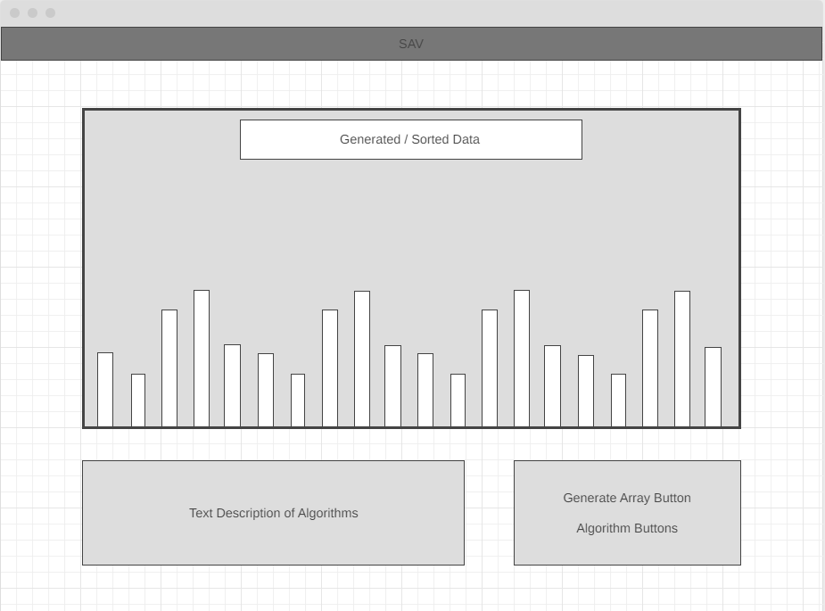

# SAV - Sorting Algorithm Visualizer

SAV is a web app dedicated to helping users visualize popular sorting algorithms.

## Background

For anyone interested in programming, it's almost a given that they will encounter sorting algorithms. When learning about these various sorting algorithms, it can be difficult to see and understand the difference between all of them.

This web app serves to provide users a brief overview of the difference in approach and performance across different sorting algorithms.

NOTE: By no means are the algorithms in this web app exhaustive! There are many sorting algorithms out there, but generally many of them fall under the same time complexity (i.e. they will take comparatively the same amount of time when considering asymptotic analysis).

## Functionality & MVPs

Using SAV, users will be able to:
  1) Choose from a selection of sorting algorithms to visualize
  2) Generate a new set of data to be sorted
  3) Adjust the amount of data being sorted
  4) Read text descriptions of the algorithms side-by-side with the visualization

In addition, this project will include:
  1) General instructions for use of the web app
  2) A production README

## Wireframe

## Technologies and APIs

- Vanilla JS for all sorting algorithm scripts
- CSS to help visualize real-time sorting of data

## Implementation Timeline

Friday Afternoon & Weekend:
- Sorting visualization for Bubble Sort, Merge Sort, and Quick Sort
- Basic styling for randomly generated data
- Buttons to allow website functionality

Monday:
- Necessary refactoring for sorting visualizations
- Instructions for website use
- Text descriptions for the algorithms
- More robust styling

Tuesday:
- Bonus sorting algorithms (Insertion Sort, Heap Sort)
- Bonus text descriptions

Wednesday:
- Necessary refactoring for bonus algorithms
- Last-minute styling additions

Thursday Morning:
- Necessary bugfixes and code refactoring
- Project hosting